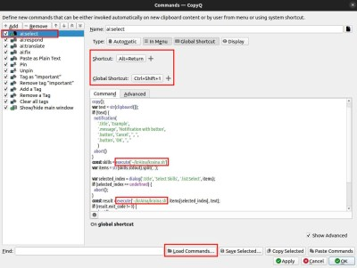

## Overview
Set of AI-powered skills for everyday use.

Skills are actions that can be performed on selected text.

KrAIna can be easily equipped with new skills. Check the `skills` folder. The structure is as follows:
```
skills/
├── fix
│     ├── prompt.md - skill system prompt, required
│     ├── config.yaml - skill and LLM settings, optional
│     ├── py_module.py - overwrite default behavior of skill, specialization - must be defined in model.yaml
```

## Install
1. Clone the project.
2. Create a virtual environment and install the requirements from requirements.txt.
3. Create a `.env` file and add:
   1. `OPENAI_API_KEY=sk-...` - OpenAI API key

### CopyQ Custom Action Installation

1. Edit and save the `copyQ/ai_select.ini` file:
   * Adjust the path `~/krAIna/kraina.sh` to your needs.
   * Change or remove shortcuts if needed (global shortcut CTRL+SHIFT+1, CopyQ shortcut ALT+RETURN).
2. Open CopyQ and go to `Command/Global shortcuts...` <F6>.
3. Select `Load Commands...` and import the `copyQ/ai_select.ini` file.



Also, check `copyQ/ai_translate.ini` to have the translation skill only as a CopyQ Custom Action.

## Usage

1. Get all supported skills: `./kraina.sh`
2. Translate: `./kraina.sh translate "Cześć, co słychać u Ciebie?"`
3. Git commit: `./kraina.sh commit "$(git diff --staged --no-prefix -U10)"`

### CopyQ Usage
To use the krAIna CopyQ Custom Action **ai:select**:
1. Select text.
2. Press CTRL+SHIFT+1.
3. Select the skill you'd like to use and press ENTER.
4. Once the action finishes, the selected text is replaced with the transformed one.


Alternatively:
1. Select and copy text to the clipboard.
2. Open CopyQ.
3. Right-click on the copied text and select the **ai:select** Custom Action (or press ALT+RETURN).
4. Once the action finishes, the selected text is