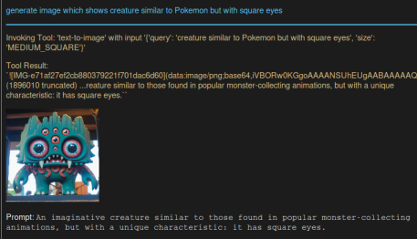
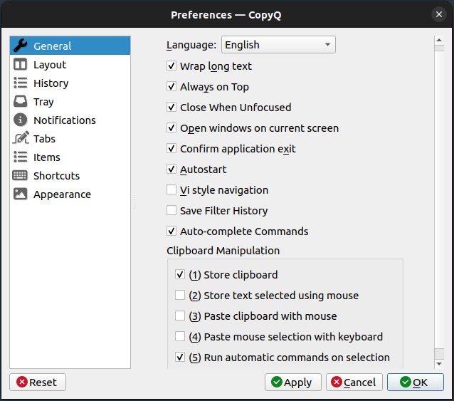
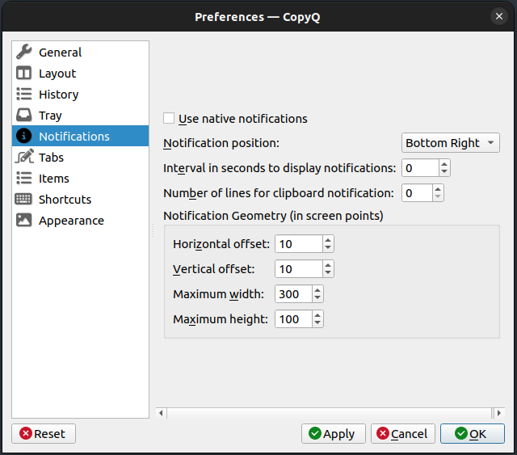

## Overview


Set of AI-powered tools for everyday use with OpenAi, Azure OpenAI, or Anthropic LLMs.
1. [Chat](#chat-gui-application) - Chat GUI application built using tkinter for Assistants and Snippets.
2. [Snippets](#snippets) — the actions that can be performed on selected text.
3. [Assistants](#assistants) — your own specialized assistants to talk with.
4. [Tools](#tools) — your own specialized tools to use with Assistants.
5. [Macros](#macros) - Python scripts to program Agent-like flow

### Chat GUI application
Chat GUI application built using tkinter.


features:
* Chat with history (HTML and text tabs available)
* Light/Dark and other build-in themes
* Chats history which can be recalled. They are auto-named and describe
* Chat history management (Pin/Unpin, make inactive, edit name, description, delete permanent, copy chat to clipboard)
* Assistant selection
* Support for snippets — right-click in the user query widget to apply transformation on a text
* Overwrite Assistant settings
* persistence storage on exit
* progress bar to visualize that LLM is working
* status bar with information about estimated token used for system prompt, history, tools, completions. OpenAI tiktoken is used. Thus, for Anthropic LLM, this can be less accurate
* Live token estimation for a user query. OpenAI tiktoken is used. Thus, for Anthropic LLM, this can be less accurate
* Inter-process communication. The chat app initiates an IPC host, enabling control, such as:
  * `chat.sh SHOW_APP` or `chat.bat SHOW_APP` which run Chat application or show it. It can be assigned to a global shortcut in OS 
  * run Chat application snippets `chat.sh RUN_SNIPPET translate "Co tam słychać?"` or `chat.bat RUN_SNIPPET translate "Co tam słychać?"`
* Markdown/HTML support
* Debug Window (right-bottom corner) with the application logs
* Copy last AI response automatically to system clipboard
* Macro management window
* Right-click on assistant, snippet or macro allows editing it
* Handling text-to-image generation (Images are stored as data URLs in app memory)
* Handling image-to-text - Drag'n'Drop image or paste it to the user query filed

### Snippets
Snippets are actions that can be performed on selected text. 

KrAIna can be easily equipped with new snippets. Check the `snippets` folder. The structure is as follows:
```
snipptes/
├── fix
│     ├── prompt.md - snippet system prompt, required
│     ├── config.yaml - snippet and LLM settings, optional
│     ├── py_module.py - overwrite default behavior of snippet, specialization - must be defined in model.yaml
```

config.yaml schema:
```yaml
# Defaults are listed here which are used when config is not defined (not available in snippet config.yaml)
# Optional. Force api: azure or openai or anthropic
force_api: ""
model: gpt-3.5-turbo
temperature: 0.5
max_tokens: 512
```

You can add additional context to the Snippet (the same scheme as for Assistant) by adding:
```yaml
contexts:
  string: Examples
  file:
    - ./example1.txt
    - ./example2.txt
```
to `config.yaml` file. The fields are parsed and added to the system prompt:
```
... system prompt ...
Take into consideration the context below while generating answers.
# Context:
## 0
Examples
## 1
./example1.txt content with blocked template placeholders ({placeholder} -> {{placeholder}})
## 2
./example2.txt content with blocked template placeholders ({placeholder} -> {{placeholder}})
## 3
Current date: {date}
```

**Note**:
This part is always added, regardless of the `contexts` key exists in `config.yaml`.
This part is not added when the `config.yaml` file does not exist.

```
Take into consideration the context below while generating answers.
# Context:
## 0
Current date: {date}
```

### Assistants
Your personal AI assistant. It can be a casual assistant or prompt engineer or storyteller.
Assistant can be run as one-shot, similar to snippets or can use its memory and remember the conversation.

The assistants have been designed similar to Snippets. Check the `assistants` folder.

config.yaml schema:
```yaml
# Defaults are listed here which are used when config is not defined (not available in assistant config.yaml)
# Optional. Force api: azure or openai or anthropic
force_api: ""
model: gpt-3.5-turbo
temperature: 0.7
max_tokens: 512
tools:
  - 
description: 
contexts:
  # string: We are located in Haiti
  # string: 
  #   - We are located in Haiti
  #   - We have sunny whether
  # file: ./about_me.txt
  # file:
  #   - ./about_me.txt
  #   - ./my_projects.txt 
```

You can add additional context to the Assistant by adding:
```yaml
contexts:
  string_template: We are located in {place} # Note that this string will be added as `We are located in {place}` (place placeholder must be provided)
  string: We are located in {place} # Note that this string will be added `as We are located in {{place}}` (with blocked template placeholder) 
  # string: 
  #   - We are located in Haiti
  #   - We have sunny whether
  file: ./about_me.txt
  file_template: ./about_me.txt
  # file:
  #   - ./about_me.txt
  #   - ./my_projects.txt 
```
to `config.yaml` file. The fields are parsed and added to the system prompt:
```
... system prompt ...
Take into consideration the context below while generating answers.
# Context:
## 0
We are located in {place}
## 1
We are located in {{place}}
## 2
./about_me.txt content
## 3
Current date: {date}
```

**Note**:
This part is always added, regardless of whether the `contexts` key exists in `config.yaml`.
This part is not added when the `config.yaml` file does not exist.

```
Take into consideration the context below while generating answers.
# Context:
## 0
Current date: {date}
```


The assistants can use tools. To do this:
1. Assign [Tools](#tools) by listing them in the assistant `config.yaml` key
   ```yaml
   tools:
     - brave_web
     - file_search
     - text-to-image
     - vector-search
     - joplin-search
   ```
2. Use models capable of doing Functional Calling like gpt-4o, gpt-3.5-turbo, gpt-4-turbo


### Tools

Set of tools available for Assistants in KrAIna.
**To make it available for selected Assistant, edit Assistant `config.yaml` and add it under `tools`.**

To make such a tool, you need to follow these steps:
1. Find or develop a tool derived from BaseTool.
   1. Check https://python.langchain.com/v0.2/docs/integrations/tools/ for built-in in langchain tools
   2. Check https://python.langchain.com/v0.2/docs/integrations/toolkits/ for built-in in langchain tools
   3. Check https://python.langchain.com/v0.2/docs/how_to/custom_tools/ how to create your own tool 
2. Create an initialization function that:
   1. Must accept one parameter, `tool_settings` (even if you don't have any settings).
   2. Must return `BaseTool` or `List[BaseTool]`.
3. Add your tool to the `SUPPORTED_TOOLS` dictionary in **tools/include.py**. The name of your tool is the key of the `SUPPORTED_TOOLS` dictionary.

The initialization of the tool (calling the init function) occurs when an Assistant is called, not when it is initialized.

#### Text-to-image



Text-to-image tool is a wrapper for Dall-e API.
It works with OpenAI and AzureOpenAI.
This tool generates images based on a textual description.
Parameters:
- **query (string):** A description of the image you want to generate. This is the main input that defines what the image will look like.
- **size (optional, enum):** The size of the generated image. Options include:
  - "SMALL_SQUARE"
  - "MEDIUM_SQUARE"
  - "LARGE_SQUARE"
  - "LARGE_LANDSCAPE"
  - "LARGE_PORTRAIT"
- **no_of_images (optional, integer):** The number of images to generate. The default value is 1.

By default, `Dall-e-3` model is used, but it can be change in `config.yaml`:
``` yaml
tools:
  text-to-image:
    # dall-e-2 or dall-e-3 are supported
    model: dall-e-3
```

#### Vector-search

This tool is used to perform semantic searches on documents.
User uploads a document to an in-memory vector database and then query it with a specific question.
The tool will return the top results that are most relevant to the query.
Parameters:
- **query**: A short, well-structured query string that you want to search for within the document. This query should clearly represent the information you are seeking.
- **file_path**: The local file path of the document you want to upload and query in the vector database.
- **k**: An integer specifying how many top similar results to return. Relevance ranks the results, with the first one being the most valuable. The maximum value for this parameter is 15.

The tool uses LangChain document loaders and in-memory vector storage to process local files.
The file is split and stored only once (embedding is done once),
and the vector database is dumped to a local file (located in `.store_files`),
so the next queries against the file do not require new file processing.

Depends on the LLM used, whether it's OpenAI, Azure or Anthropic, the corresponding embedding endpoint is used.

> [!Note]
> Anthropic LLM required [Voyage AI](https://www.voyageai.com) service. See [Voyage docs](https://docs.voyageai.com/docs/api-key-and-installation) for details

By default, `text-embedding-ada-002` (for Anthropic `voyage-3`) model is used, but it can be change in `config.yaml`:
``` yaml
tools:
  vector-search:
    model: text-embedding-ada-002
```

Currently supported file formats:
- *.pdf
- *.txt
- *.log
- *.csv
- *.md

The file splitters are created by inherit `FileSplitter` class from [vector_store_file_splitter](tools/vector_store_file_splitter.py) file.
Check this file to find how to add new file splitters.

#### joplin-search

This tool is used to perform semantic searches on data stored in [Joplin](https://joplinapp.org), local note-taking app.
User uploads a document to an in-memory vector database and then query it with a specific question.
The tool will return the top results that are most relevant to the query.
Parameters:
- **query**: A short, well-structured query string that you want to search for within the document. This query should clearly represent the information you are seeking.
- **k**: An integer specifying how many top similar results to return. Relevance ranks the results, with the first one being the most valuable. The maximum value for this parameter is 15.

The tool uses LangChain document loader and in-memory vector storage to process local files.
The LangChain Joplin loader requires an API key:
1. Open the Joplin app. The app must stay open while the documents are being loaded.
2. Go to settings / options and select "Web Clipper".
3. Make sure that the Web Clipper service is enabled.
4. Under "Advanced Options", copy the authorization token.
5. Write the `JOPLIN_API_KEY=<authorization token>` in .env file

The data from Joplin is loaded and split using the Markdown splitter and stored only once (embedding is done once).
The vector database is then dumped to a local file (located in `.store_files`),
so the next queries against the file do not require new file processing unless the Joplin data updates.

Depends on the LLM used, whether it's OpenAI or Azure; the corresponding embedding endpoint is used.

By default, `text-embedding-ada-002` model is used, but it can be change in `config.yaml`:
``` yaml
tools:
  joplin-search:
    model: text-embedding-ada-002
```

### Macros
Your Agent-like Python scripts. You can program long HTML document generation on a selected topic or develop, review and correct code.

The macro file is a regular Pytho script that can be run like a typical Python script,
but it can also function as a macro within the Chat application.
It must contain a `run()` function, which is the only requirement for it to be executable within the Chat application.
When the macro file is loaded by the Chat application as a module, it inspects the `run()` function to get docstring and parameters + annotations.
Subsequently, when the macro is called, the `run()` function is executed in a daemon thread.
In this mode, the Chat application logger is used.

The macros discover works similar to Assistants and Snippets. Search `macros` folder in KrAIna and kraina-lands to find
all Python scripts with `run()` function inside.


Check examples [Pokemon overview](macros/pokemon_overview.py) or [Topic overview](macros/topic_overview.py) for more details.


## Requirements
1. Python >= 3.10 + IDLE (Tk GUI)
2. Python venv package
3. Git

## Install
1. Clone the project.
2. Run the `setup.sh` or `setup.bat` script from `setup_script`, which executes the commands below, or run the commands below by yourself.

    1. Create a virtual environment: `python3 -m venv .venv`
    2. Install the requirements from `requirements.txt`: `pip install -r requirements.txt`.
    3. Create a `.env` file (`cp .env.template .env`) and add:
        1. `OPENAI_API_KEY=sk-...` - OpenAI API key
        2. `AZURE_OPENAI_ENDPOINT` + `AZURE_OPENAI_API_KEY` + `OPENAI_API_VERSION` - AzureAI API key if you'd like to use it
        3. `ANTHROPIC_API_KEY` - Anthropic API key if you'd like to use it
        4. Tools providers API key
    4. Create a `config.yaml` (`cp config.yaml.template config.yaml`) and modify if needed.

---
*Note*:
By default, the highest priority has Azure OpenAI LLM, next OpenAI and the last Anthropic.
Thus, if all API keys exist, Azure OpenAI is selected. If OpenAI and Anthropic, OpenAI is selected.
---
*Note*:
Versioning and auto-updating of the `kraina.db` schema are not supported at this time.
if you had already created `kraina.db`, update schema:
```sql
create table messages_dg_tmp
(
    message_id      INTEGER  not null
        constraint pk_messages
            primary key,
    conversation_id INTEGER  not null
        constraint fk_messages_conversation_id_conversations
            references conversations
            on delete cascade,
    type            INTEGER  not null,
    message         VARCHAR  not null,
    create_at       DATETIME not null
);

insert into messages_dg_tmp(message_id, conversation_id, type, message, create_at)
select message_id, conversation_id, type, message, create_at
from messages;

drop table messages;

alter table messages_dg_tmp
    rename to messages;

create index ix_messages_conversation_id
    on messages (conversation_id);

create index messages_message_id_index
    on messages (message_id);

alter table conversations
    add priority integer default 0 not null;
```
---

### [CopyQ](https://github.com/hluk/CopyQ/tree/master) Custom Action Installation

AI-powered snippets are nothing without a good user interface to make it possible to use them in any tool. 
One way to boost your work performance is by performing snippets on the clipboard context with a Clipboard manager using global hotkeys.

Imagine that you are working with a text or code in your favorite editor, and you need to translate it or add docstring to Python method.
Select the text, press `ALT+SHIFT+1`, choose desire transformation (translate, fix or docstring) press Enter and that's all.
KrAIna will transform selected text.

[CopyQ](https://github.com/hluk/CopyQ/tree/master) Clipboard monitor can help you with it on Windows and Linux!
1. Install it (Use COpy! 7.1.0. The newer versions have some strange problems with the main window focus)
2. Run it and adjust settings to your need. My settings:

 

3. Install Custom Action `copyQ/toggle.ini` to have working global hotkey `CTR+~` to show/hide CopyQ
4. Install Custom Action `copyQ/kraina_run.ini` to have working global hotkey `ALT+SHITF+~` to show/hide KrAIna Chat
5. Install Custom Action `copyQ/ai_select.ini` to have working global hotkey `ALT+SHITF+1` to show/hide CopyQ
6. Check also other CopyQ Custom Actions in [copyQ](copyQ/README.md)

How to install such action in CopyQ:
1. Open CopyQ and go to `Command/Global shortcuts...` <F6>.
2. Select `Load Commands...` and import the `copyQ/ai_select.ini` file.
3. Edit snippet:
   * Adjust the path to your needs:
    ``` js
   // Set KrAIna installation folder in your home folder 
   var kraina_dir = '/repos_personal/krAIna/';
   ```
   * Change or remove shortcuts if needed (global hotkey ALT+SHIFT+1, CopyQ shortcut ALT+RETURN).
4. Save and that's all.


---
*Note*:
1. Tested with CopyQ 7.1.0 (8.0.0 has some problem with the main window focus)
2. To get popup notifications (usually on errors), disable `Use native notifications` in CopyQ Preferences...
3. To have working a global hotkey to show/hide CopyQ main app (on Windows and Linux) load `copyQ/toggle.ini` custom action
---

## Configuration

The configuration is handled by `config.yaml` file.

File Schema:
```yaml
llm:
  # LLM settings
  map_model:
    # map model names from snippet/assistant yaml files into models per API type
    # Using alias like `A` or `B`, you can quickly change API from OpenAI to Anthropic
    azure:
      A: gpt-4o
      B: gpt-35-turbo
      gpt-4-turbo: gpt-4-turbo-128k
      gpt-3.5-turbo: gpt-35-turbo
    openai:
      A: gpt-4o
      B: gpt-3.5-turbo
    anthropic:
      A: claude-3-5-sonnet-20240620
      B: claude-3-haiku-20240307
chat:
   # Chat settings
   # Always start New Chat with selected assistant. If defaulted, last used will be used
   default_assistant: samantha
   # maximum last chats to display in the left sidebar
   visible_last_chats: 10
   # Default editor. It can be string or list. If nothing, default system is used
   #   editor: subl
   #   editor:
   #     - subl
   #     - -b
   editor:
assistants:
   # assistants settings
   # assistant name:
   #    settings
   # aren't implemented yet
snippets:
   # snippets settings
   # snippet name:
   #    settings
   # aren't implemented yet
tools:
   # tools settings
   # tool name:
   #    settings
  brave_web:
    count: 3
  text-to-image:
    model: dall-e-3
  vector-search:
    model: text-embedding-ada-002
  joplin-search:
    model: text-embedding-ada-002
```

## Extensions

KrAIna can be easily extended by personal, third-party sets of the above beings by creating a folder (or creating a symlink) in KrAIna.

1. The folder must contain a file named `.kraina-land` - this is a tag file for KrAIna to scan the folder
2. To extend KrAIna with new snippets, assistants, or tools, create the respective folder names
3. Follow KrAIna structure of these new sets
4. Example folder structure
   ```
    ├── kraina
            ├──kraina-personal
                   ├── .kraina-land
                   ├── snippets
                   │     ├── create_jira 
                   │          ├── prompt.md
                   │          ├── config.yaml
                   ├── assistants
                   │        ├── database 
                   │            ├── prompt.md
                   │            ├── config.yaml
                   ├── tools
                   │     ├── database 
                   │          ├── __init__.py
                   │          ├── ...
                   │     ├── include.py
   ```

## Usage

### CLI

#### kraina.sh | kraina.bat

Those are helper scripts that call Python kraina.py script inside venv.
```
usage: kraina.sh [-h]
                 [--snippet {commit,summary,ocr,doit,translate,nameit,docstring,fix,ticket,toztest,kup,}]
                 [--text TEXT] [--file FILE]

Transform text using snippet. To transform long text like source code or some
long paragraph on Windows the best option is --file parameter as passing the
text via command line parameter is problematic. File provided to --file
parameter must include name of snippet in first line. The rest of file is
treat as text to transform.

options:
  -h                    show this help message and exit
  --snippet {commit,summary,ocr,doit,translate,nameit,docstring,fix,ticket,toztest,kup,}
                        Snippet to use
  --text TEXT           Text to transform
  --file FILE           Read and parse snippet and text from file. File
                        format: snippet\ntext, snippet must be in first line.
                        Rest file is treat as text. Use instead of --snippet +
                        --text to pass complicated text to transform

```

1. Get all supported snippets: `./kraina.sh` or `./kraina.bat`
2. Alternative you can use `list_skills.sh` or `list_skills.bat` - much faster scripts as they are not use python
3. Translate: `./kraina.sh translate "Cześć, co słychać u Ciebie?"` or `./kraina.bat translate "Cześć, co słychać u Ciebie?"`
4. Git commit: `./kraina.sh commit "$(git diff --staged --no-prefix -U10)"` or `echo commit > %TEMP%/diff & git diff --no-prefix -U10 >> %TEMP%/diff & kraina.bat --file %TEMP%/diff & del %TEMP%/diff`

#### chat.sh | chat.bat

```
usage: chat.sh command

KraIna chat application.
Commands:
        SHOW_APP - Trigger to display the application
        HIDE_APP - Trigger to minimize the application
        GET_LIST_OF_SNIPPETS - Get list of snippets
        RUN_SNIPPET - Run snippet 'name' with 'text'
        RELOAD_CHAT_LIST - Reload chat list
        SELECT_CHAT - Select conv_id chat
        DEL_CHAT - Delete conv_id chat
        No argument - run GUI app. If app is already run, show it

options:
  -h, --help  show this help message and exit

```

1. Start the application by running `./chat.sh` or `./chat.bat`.
2. You can also use `./chat.sh COMMAND` or `./chat.bat COMMAND` to control the application with the supported commands, e.g.:
    ```text
    SHOW_APP - Trigger to display the application
    RUN_SNIPPET translate "Co słychać u Ciebie"
    ```
3. You can assign `./chat.sh SHOW_APP` or `./chat.bat SHOW_APP` to a system global shortcut to show KrAIna Chat quickly

### CopyQ Usage
To use the krAIna CopyQ Custom Action **ai:select**:
1. Select text.
2. Press ALT+SHIFT+1.
3. Select the snippet you'd like to use and press ENTER.
4. Once the action finishes, the selected text is replaced with the transformed one.


Alternatively:
1. Select and copy text to the clipboard.
2. Open CopyQ.
3. Right-click on the copied text and select the **ai:select** Custom Action (or press ALT+RETURN).
4. Once the action finishes, the selected text is replaced with the transformed one.

### Code

#### Snippets
```python
from dotenv import load_dotenv, find_dotenv
from snippets.base import Snippets

load_dotenv(find_dotenv())
snippets = Snippets()
action = snippets["fix"]
print(action.run("I'd like to speak something interest"))
```

#### Assistants
```python
from dotenv import load_dotenv, find_dotenv
from assistants.base import Assistants

load_dotenv(find_dotenv())
assistants = Assistants()
# one shot, do not use a database
action = assistants["echo"]
ret = action.run("2+2", use_db=False)
print(ret)  # AssistantResp(conv_id=None, content='2 + 2 equals 4.', tokens={'api': {'model': 'gpt-3.5-turbo', 'max_tokens': 512, 'temp': 0.7}, 'prompt': 31, 'history': 0, 'input': 6, 'total_input': 37, 'output': 11, 'total': 85}, error=None)
# with history
first = action.run("My name is Paul")  # First call without conv_id creates a new conversation
print(first)  # AssistantResp(conv_id=192, content='Nice to meet you, Paul! How can I assist you today?', tokens={'api': {'model': 'gpt-3.5-turbo', 'max_tokens': 512, 'temp': 0.7}, 'prompt': 31, 'history': 7, 'input': 7, 'total_input': 45, 'output': 17, 'total': 107}, error=None)
ret = action.run("What's my name?", conv_id=first.conv_id) # Second call with conv_id
print(ret)  # AssistantResp(conv_id=192, content='Your name is Paul. How can I assist you today, Paul?', tokens={'api': {'model': 'gpt-3.5-turbo', 'max_tokens': 512, 'temp': 0.7}, 'prompt': 31, 'history': 24, 'input': 8, 'total_input': 63, 'output': 17, 'total': 143}, error=None)

```

```python
from dotenv import load_dotenv, find_dotenv
from assistants.base import Assistants
from libs.utils import convert_llm_response, convert_user_query

load_dotenv(find_dotenv())
assistants = Assistants()

# text-to-image
llm = assistants["samantha"]  # Samantha assistant is equipped with text-to-image tool 
ret = llm.run("generate me low size image of sheep with electronic head", use_db=False)
print(ret.content[0:120])  #  function get base64 data URL and save it to temporary file
print(convert_llm_response(ret.content))  #   

# image-to-text from URL
# convert_user_query() gets Markdown image (with URL, local file or base64 data URL) and convert it to proper base64 data URL
ret = llm.run(
    convert_user_query(
        "Do ocr of the file: ",
    ),
    use_db=False,
)
print(ret)  # AssistantResp(conv_id=None, content="Here is the extracted text from the image:\n\n```\nKrAIna CHAT\n\nFile Llm Settings\n\nNEW CHAT\nLast chats\n   Micros...

# image-to-text from local file
ret = llm.run(
    convert_user_query(
        "Do ocr of the file: ",
    ),
    use_db=False,
)
print(ret)  # AssistantResp(conv_id=None, content="Here is the extracted text from the image:\n\n```\nKrAIna CHAT\n\nFile Llm Settings\n\nNEW CHAT\nLast chats\n   Micros...

```

#### Chat interface

Like [chat.sh](#chatsh--chatbat) but from Python script. It is very useful for [macro](#macros) scripts

```python
from chat.cli import ChatInterface
from dotenv import load_dotenv, find_dotenv
from assistants.base import Assistants

load_dotenv(find_dotenv())
assistants = Assistants()

action = assistants["echo"]
# init communication with Chat app. silent=True means, do not raise exception if Chat app is not running.
chat = ChatInterface(silent=True)

ret = action.run("What are the Pokemons?")  # First call without conv_id creates a new conversation

chat("SHOW_APP")  # Show Chat app
chat("RELOAD_CHAT_LIST")  # Reload, find new chats in Chat app
chat("SELECT_CHAT", ret.conv_id)  # Show our conversation
action.run("What are the types?", conv_id=ret.conv_id)  # Continue conversation
chat("SELECT_CHAT", ret.conv_id)  # Update our conversation
```