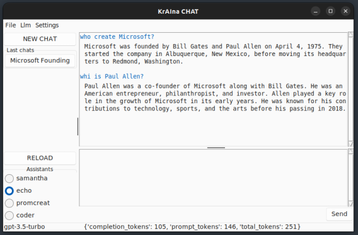
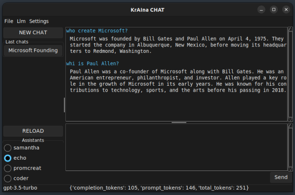
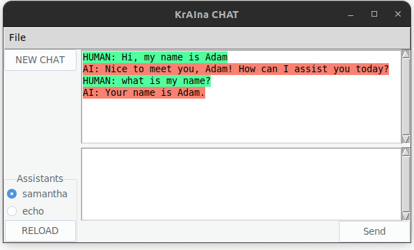
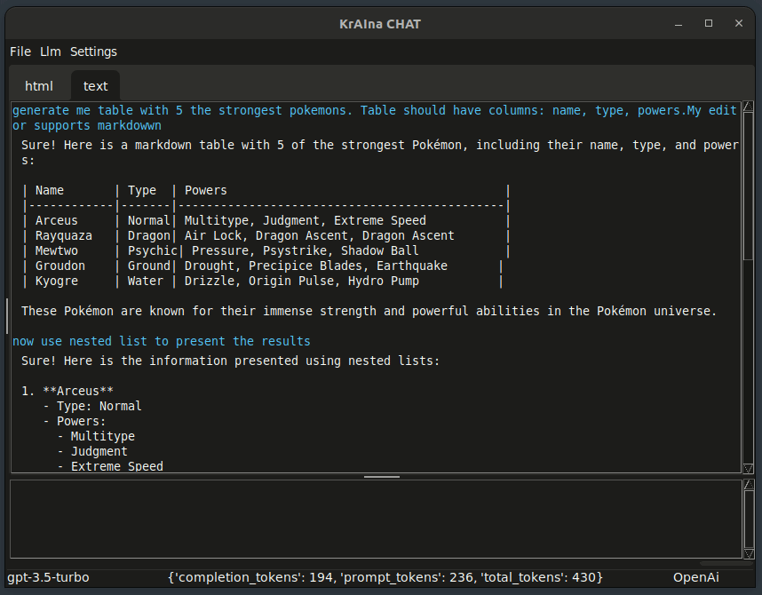

## Overview
Set of AI-powered tools for everyday use with OpenAi, Azure OpenAI or Anthropic LLMs.
1. **Snippets** — the actions that can be performed on selected text.
2. **Assistants** — your own specialized assistants to talk with.
3. **Tools** — your own specialized tools to use with Assistants.

KrAIna can be easily extended by personal, third-party sets of the above beings by creating folder (or create symlink) in KrAIna.

1. The folder must contain file named `.kraina-land` - this is tag file for KrAIna to scan the folder
2. To extend KrAIna with new snippets, assistants or tools create the respective folders names
3. Follow KrAIna structure of these new sets
4. Example folder structure
   ```
    ├── kraina
            ├──kraina-personal
                   ├── .kraina-land
                   ├── snippets
                   │     ├── create_jira 
                   │          ├── prompt.md
                   │          ├── config.yaml
                   ├── assistants
                   │        ├── database 
                   │            ├── prompt.md
                   │            ├── config.yaml
                   ├── tools
                   │     ├── database 
                   │          ├── __init__.py
                   │          ├── ...
                   │     ├── include.py
   ```

**Chat** - Chat GUI application built using tkinter for Assistants and Snippets.

**Currently on available on Linux**

### Snippets
Snippets are actions that can be performed on selected text. 

KrAIna can be easily equipped with new snippets. Check the `snippets` folder. The structure is as follows:
```
snipptes/
├── fix
│     ├── prompt.md - snippet system prompt, required
│     ├── config.yaml - snippet and LLM settings, optional
│     ├── py_module.py - overwrite default behavior of snippet, specialization - must be defined in model.yaml
```

config.yaml schema:
```yaml
# Defaults are listed here which are used when config is not defined (not available in snippet config.yaml)
# Optional. Force api: azure or openai or anthropic
force_api: null
model: gpt-3.5-turbo
temperature: 0.5
max_tokens: 512
```

You can add additional context to the Snippet (the same scheme as for Assistant) by adding:
```yaml
contexts:
  string: Examples
  file:
    - ./example1.txt
    - ./example2.txt
```
to `config.yaml` file. The fields are parsed and added to system prompt:
```
... system prompt ...
Take into consideration the context below while generating answers.
# Context:
## 0
Examples
## 1
./example1.txt content with blocked template placeholders ({placeholder} -> {{placeholder}})
## 2
./example2.txt content with blocked template placeholders ({placeholder} -> {{placeholder}})
## 3
Current date: {date}
```

**Note**:
This part is always added, regardless of whether the `contexts` key exists in `config.yaml`.
This part is not added when the `config.yaml` file does not exist.

```
Take into consideration the context below while generating answers.
# Context:
## 0
Current date: {date}
```

However, AI-powered snippets are nothing without a good user interface to make it possible to use them in any tool. 
One way to boost your work performance is by performing snippets on the clipboard context with a Clipboard manager.

### Assistants
Your personal AI assistant. It can be a causal assistant or prompt engineer or storyteller.
Assistant can be run as one-shot, similar to snippets or can use its memory and remember the conversation.

The assistants have been designed similar to Snippets. Check the `assistants` folder.

config.yaml schema:
```yaml
# Defaults are listed here which are used when config is not defined (not available in assistant config.yaml)
# Optional. Force api: azure or openai or anthropic
force_api: null
model: gpt-3.5-turbo
temperature: 0.7
max_tokens: 512
tools:
  - 
description: 
contexts:
  # string: We are located in Haiti
  # string: 
  #   - We are located in Haiti
  #   - We have sunny whether
  # file: ./about_me.txt
  # file:
  #   - ./about_me.txt
  #   - ./my_projects.txt 
```

You can add additional context to the Assistant by adding:
```yaml
contexts:
  string_template: We are located in {place} # Note that this string will be added as `We are located in {place}` (place placeholder must be provided)
  string: We are located in {place} # Note that this string will be added `as We are located in {{place}}` (with blocked template placeholder) 
  # string: 
  #   - We are located in Haiti
  #   - We have sunny whether
  file: ./about_me.txt
  file_template: ./about_me.txt
  # file:
  #   - ./about_me.txt
  #   - ./my_projects.txt 
```
to `config.yaml` file. The fields are parsed and added to system prompt:
```
... system prompt ...
Take into consideration the context below while generating answers.
# Context:
## 0
We are located in {place}
## 1
We are located in {{place}}
## 2
./about_me.txt content
## 3
Current date: {date}
```

**Note**:
This part is always added, regardless of whether the `contexts` key exists in `config.yaml`.
This part is not added when the `config.yaml` file does not exist.

```
Take into consideration the context below while generating answers.
# Context:
## 0
Current date: {date}
```


The assistants can use tools. To do this:
1. Assign tools (LangChain BaseTools) by listing them in assistant `config.yaml` key
   ```yaml
   tools:
     - brave_web
     - file_search
   ```
2. Use models capable to do Functional Calling like gpt-4o, gpt-3.5-turbo, gpt-4-turbo


### Tools

Set of tools available to others in krAIna. 

To make such a tool, you need to follow these steps:
1. Find or develop a tool derived from BaseTool.
2. Create an initialization function that:
   1. Must accept one parameter, `tool_settings` (even if you don't have any settings).
   2. Must return `BaseTool` or `List[BaseTool]`.
3. Add your tool to the `SUPPORTED_TOOLS` dictionary in **tools/include.py**. The name of your tool is the key of the `SUPPORTED_TOOLS` dictionary.

The initialization of the tool (calling the init function) occurs when an Assistant is called, 
not when it is initialized.

### Chat GUI application
Chat GUI application build using tkinter.

 



Markdown is now supported:



features:
* Chat with history (html and text tabs available)
* Light/Dark theme
* Last 10 chats which can be recalled. They are auto-named and describe
* Assistant selection
* Support for snippets — right-click in user query widget to apply transformation on a text
* Overwrite Assistant settings
* persistence storage on exit
* progress bar to visualize that LLM is working
* status bar with information about estimated token used for system prompt, history, tools, completions
* Live token estimation for user query
* Inter-process communication. The chat app initiates an IPC host, enabling control, such as assigning a global shortcut to execute `chat.sh SHOW_APP`.
* Markdown support

## Install
1. Clone the project.
2. Create a virtual environment and install the requirements from requirements.txt `pip install -r requirements.txt`.
3. Optional: If you'd like to use Chat GUI, please install also requirements for it `pip install -r chat/requirements.txt` 
4. Create a `.env` file and add:
   1. `OPENAI_API_KEY=sk-...` - OpenAI API key
   2. `AZURE_OPENAI_ENDPOINT` + `AZURE_OPENAI_API_KEY` + `OPENAI_API_VERSION` - AzureAI API key if you'd like to use it
   3. `ANTHROPIC_API_KEY` - Anthropic API key if you'd like to use it
---
*Note*:
By default, the highest priority has Azure OpenAI LLM, next OpeAI and the last Anthropic.
Thus, if all API keys exist, Azure OpenAI is selected. If OpenAI and Anthropic, OpenAi is selected.
---

### [CopyQ](https://github.com/hluk/CopyQ/tree/master) Custom Action Installation

1. Edit and save the `copyQ/ai_select.ini` file:
   * Adjust the path `~/krAIna/kraina.sh` to your needs.
   * Change or remove shortcuts if needed (global shortcut ALT+SHIFT+1, CopyQ shortcut ALT+RETURN).
2. Open CopyQ and go to `Command/Global shortcuts...` <F6>.
3. Select `Load Commands...` and import the `copyQ/ai_select.ini` file.


Check also other CopyQ Custom Actions in `copyQ`.

---
*Note*:
1. Tested with CopyQ 7.1.0 (8.0.0 has some problem with main window focus)
2. To get popup notifications (usually on errors), disable `Use native notifications` in CopyQ Preferences...
---

## Configuration

The configuration is handled by `config.yaml` file.

File Schema:
```yaml
llm:
  # LLM settings
  map_model:
    # map model names from snippet/assistant yaml files into models per API type
    # Using alias like `A` or `B`, you can quickly change API from OpenAI to Anthropic
    azure:
      A: gpt-4o
      B: gpt-35-turbo
      gpt-4-turbo: gpt-4-turbo-128k
      gpt-3.5-turbo: gpt-35-turbo
    openai:
      A: gpt-4o
      B: gpt-3.5-turbo
    anthropic:
      A: claude-3-5-sonnet-20240620
      B: claude-3-haiku-20240307
chat:
   # chat settings
   # Always start New Chat with selected assistant
   default_assistant: samantha
assistants:
   # assistants settings
   # assistant name:
   #    settings
   # aren't implemented yet
snippets:
   # snippets settings
   # snippet name:
   #    settings
   # aren't implemented yet
tools:
   # tools settings
   # tool name:
   #    settings
  brave_web:
    count: 3
```

## Usage

### CLI
1. Get all supported snippets: `./kraina.sh`
2. Translate: `./kraina.sh translate "Cześć, co słychać u Ciebie?"`
3. Git commit: `./kraina.sh commit "$(git diff --staged --no-prefix -U10)"`

### CopyQ Usage
To use the krAIna CopyQ Custom Action **ai:select**:
1. Select text.
2. Press ALT+SHIFT+1.
3. Select the snippet you'd like to use and press ENTER.
4. Once the action finishes, the selected text is replaced with the transformed one.


Alternatively:
1. Select and copy text to the clipboard.
2. Open CopyQ.
3. Right-click on the copied text and select the **ai:select** Custom Action (or press ALT+RETURN).
4. Once the action finishes, the selected text is replaced with the transformed one.

### Chat

1. Start the application by running `./chat.sh`.
2. Utilize its features.
3. You can also use `./chat.sh COMMAND` to control the application with the following supported commands:
```text
SHOW_APP - Trigger to display the application
HIDE_APP - Trigger to minimize the application
No argument - Run the GUI app. If the app is already running, it will be shown
```
Assign `./chat.sh SHOW_APP` to system global shortkey to summon KrAIna Chat quickly, press Escape in application to minimalize it.
### Code

#### Snippets
```python
from dotenv import load_dotenv, find_dotenv
from snippets.base import Snippets

load_dotenv(find_dotenv())
snippets = Snippets()
action = snippets["fix"]
print(action.run("I'd like to speak something interest"))
```

#### Assistants
```python
from dotenv import load_dotenv, find_dotenv
from assistants.base import Assistants

load_dotenv(find_dotenv())
assistants = Assistants()
# one shot, do not use a database
action = assistants["echo"]
ret = action.run("2+2", use_db=False)
print(ret)  # AssistantResp(conv_id=None, content='2 + 2 equals 4.', tokens={'api': {'model': 'gpt-3.5-turbo', 'max_tokens': 512, 'temp': 0.7}, 'prompt': 31, 'history': 0, 'input': 6, 'total_input': 37, 'output': 11, 'total': 85}, error=None)
# with history
first = action.run("My name is Paul")  # First call without conv_id creates new conversation
print(first)  # AssistantResp(conv_id=192, content='Nice to meet you, Paul! How can I assist you today?', tokens={'api': {'model': 'gpt-3.5-turbo', 'max_tokens': 512, 'temp': 0.7}, 'prompt': 31, 'history': 7, 'input': 7, 'total_input': 45, 'output': 17, 'total': 107}, error=None)
ret = action.run("What's my name?", conv_id=first.conv_id) # Second call with conv_id
print(ret)  # AssistantResp(conv_id=192, content='Your name is Paul. How can I assist you today, Paul?', tokens={'api': {'model': 'gpt-3.5-turbo', 'max_tokens': 512, 'temp': 0.7}, 'prompt': 31, 'history': 24, 'input': 8, 'total_input': 63, 'output': 17, 'total': 143}, error=None)

```