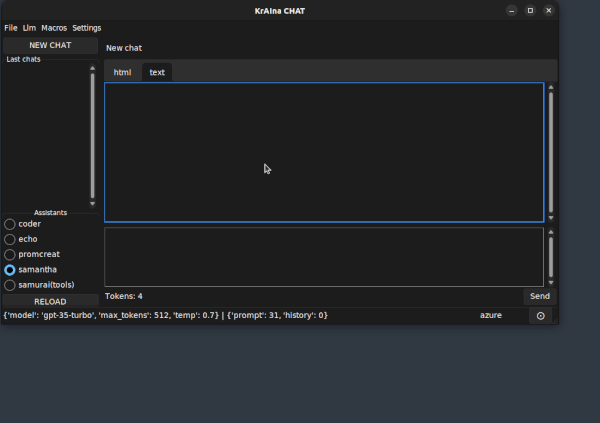
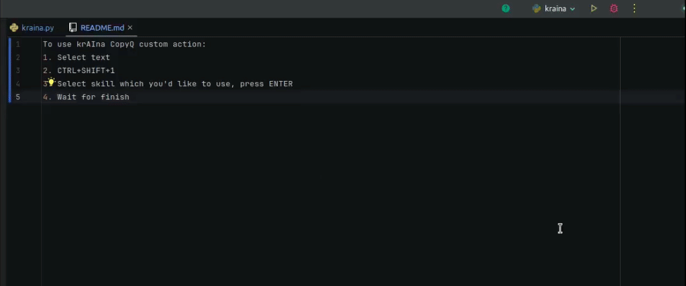

# KrAIna - AI-Powered Tools for Everyday Use


KrAIna provides standalone AI-powered tools for everyday use with OpenAI, Azure OpenAI, Anthropic, Amazon Bedrock, Google Gemini LLMs or [Ollama](https://ollama.com).

## Standalone Applications

KrAIna consists of two main standalone executables built with PyInstaller:

### kraina_app - Chat GUI Application


A modern Chat GUI application built with tkinter featuring:
- **Interactive Chat Interface** with HTML and text tabs
- **Assistant Management** - Switch between different AI assistants  
- **Snippet Integration** - Transform text with right-click context menu
- **Macro Execution** - Run Python automation scripts
- **Chat History** - Auto-named conversations with management features
- **Multi-theme Support** - Light/Dark and other built-in themes
- **Image Support** - Drag & drop images, text-to-image generation
- **Markdown/HTML Rendering** - Supports Mermaid graphs and LaTeX expressions
- **Token Estimation** - Live token usage tracking
- **Export Features** - Save chats as HTML, PDF, or text files
- **Debug Window** - Application logs and troubleshooting
- **IPC** - Control application from Python scripts or from kraina_cli
- **Drag & Drop** - Drag & drop files to chat
- **Debuging** - Debugging window with logs and troubleshooting

### kraina_cli - Command Line Interface
A CLI tool for interactove with kraina_app:
```bash
usage: kraina_cli command

KraIna chat application.
Commands:
        SHOW_APP - Trigger to display the application
        HIDE_APP - Trigger to minimize the application
        GET_LIST_OF_SNIPPETS - Get list of snippets
        RUN_SNIPPET - Run snippet 'name' with 'text'
        RUN_SNIPPET_WITH_FILE - Run snippet 'name' with 'file'
        RELOAD_CHAT_LIST - Reload chat list
        SELECT_CHAT - Select conv_id chat
        DEL_CHAT - Delete conv_id chat
        No argument - run GUI app. If app is already run, show it

options:
  -h, --help  show this help message and exit
```

## Installation & Usage

### End User Installation (Recommended)

**Requirements**: None - standalone executables include everything needed

1. **Download** the latest release containing `kraina_app` and `kraina_cli` executables
2. **First Run** - Execute `./kraina_app` or `./kraina_cli` to create configuration files
3. **Configure API Keys** - Edit the generated `.env` file:
   ```bash
   # OpenAI
   OPENAI_API_KEY=sk-...
   
   # Azure OpenAI
   AZURE_OPENAI_ENDPOINT=https://...
   AZURE_OPENAI_API_KEY=...
   OPENAI_API_VERSION=2024-02-01
   
   # Anthropic
   ANTHROPIC_API_KEY=...
   
   # AWS Bedrock
   AWS_DEFAULT_REGION=us-east-1
   AWS_ACCESS_KEY_ID=...
   AWS_SECRET_ACCESS_KEY=...
   
   # Google Gemini
   GOOGLE_API_KEY=...
   
   # Ollama (optional - leave empty for local server)
   OLLAMA_ENDPOINT=http://server:11434
   ```
4. **Start Using** - Run `./kraina_app` for GUI or `./kraina_cli --help` for CLI usage

### Basic Usage Examples

**GUI Application:**
```bash
./kraina_app                           # Start GUI
./kraina_cli SHOW_APP                  # Show running app (assign to hotkey)
./kraina_cli RUN_SNIPPET translate "Hello world"
```

**CLI Usage:**
```bash
./kraina_cli --snippet translate --text "Cześć, co słychać?"
./kraina_cli --snippet commit --text "$(git diff --staged)"
```

### User Extensibility

Create your own components alongside the executables without modifying core code:

```
your_kraina_deployment/
├── kraina_app          # Main GUI application
├── kraina_cli          # CLI tool
├── .env               # Your API keys
├── config.yaml        # Configuration
├── snippets/          # Your custom snippets
│   └── my_snippet/
│       ├── prompt.md
│       └── config.yaml
├── assistants/        # Your custom assistants
│   └── my_assistant/
│       ├── prompt.md
│       └── config.yaml
└── macros/            # Your custom macros
    └── my_macro.py
```

## Core Concepts

### Snippets
Actions that transform selected text using AI. Perfect for:
- **Text Translation** - Translate between languages
- **Code Documentation** - Generate docstrings
- **Text Improvement** - Fix grammar and style
- **Git Commits** - Generate commit messages

**Snippet Structure:**
```
snippets/my_snippet/
├── prompt.md          # System prompt (required)
├── config.yaml        # LLM settings (optional)
└── custom_logic.py    # Override behavior (optional)
```

**Configuration Example:**
```yaml
force_api: openai
model: gpt-4o
temperature: 0.5
max_tokens: 512
contexts:
  string: "Always respond in professional tone"
  file: 
    - ./examples.txt
    - ./context.md
```

### Assistants
Specialized AI personas for different tasks:
- **Conversational Memory** - Remember chat history
- **Tool Integration** - Use built-in and custom tools
- **Context Awareness** - Include custom knowledge
- **Flexible Configuration** - Customize behavior per assistant

**Assistant Structure:**
```
assistants/my_assistant/
├── prompt.md          # System prompt
└── config.yaml        # Configuration
```

**Configuration Example:**
```yaml
model: gpt-4o
temperature: 0.7
tools:
  - text-to-image
  - vector-search
  - web-search
contexts:
  string: "You are a helpful coding assistant"
  file: ./knowledge_base.md
```

### Macros
Python scripts for complex AI-powered workflows:
- **Agent-like Behavior** - Multi-step AI interactions
- **Custom Logic** - Combine multiple tools and models
- **GUI Integration** - Run from chat interface
- **Automation Ready** - Perfect for repetitive tasks



**Macro Structure:**
```python
def run(topic: str, depth: str = "basic") -> str:
    """Generate comprehensive overview of a topic.
    
    Args:
        topic: Topic to research
        depth: Detail level (basic/detailed/expert)
    """
    # Your implementation here
    return result
```

## Built-in Tools

Tools that can be used by Assistants to extend their capabilities:

### Text-to-Image
Generate images using DALL-E API.
```yaml
tools:
  text-to-image:
    model: dall-e-3  # dall-e-2 or dall-e-3
```

### Vector Search
Semantic search through documents. User uploads a document to an in-memory vector database and then query it with a specific question.

The tool uses LangChain document loaders and in-memory vector storage to process local files. The file is split and stored only once (embedding is done once), and the vector database is dumped to a local file (located in .store_files), so the next queries against the file do not require new file processing.

```yaml
tools:
  vector-search:
    model: embed
```
**Supported formats:** PDF, TXT, LOG, CSV, MD

### Audio-to-Text
Transcribe audio files using Whisper.
```yaml
tools:
  audio-to-text:
    model: whisper-1
```

### Image Analysis
Analyze and interpret images.
- **Object Detection**
- **Scene Understanding** 
- **Content Extraction**

### Text-to-Text
Process text files and web content.
- **File Reading**
- **Web Content Extraction**
- **Format Conversion**

### Joplin Search
Search through Joplin notes (requires API key). The in-memory vector database is created from all notes in the Joplin database and then query it with a specific question.

```yaml
tools:
  joplin-search:
    model: embed
```

### Web Search (Brave)
Search the web for current information.
```yaml
tools:
  brave_web:
    count: 3  # Number of results
```

## CopyQ Integration

Boost productivity with clipboard-based AI transformations:

### Setup
1. Install [CopyQ](https://github.com/hluk/CopyQ) 7.1.0
2. Import custom actions from `copyQ/` directory:
   - `ai_select.ini` - Transform selected text (ALT+SHIFT+1)
   - `kraina_run.ini` - Show/hide KrAIna (ALT+SHIFT+~)
   - `toggle.ini` - Show/hide CopyQ (CTRL+~)

More info in [readme](copyQ/README.md)

### Usage


1. **Select text** in any application
2. **Press ALT+SHIFT+1**
3. **Choose snippet** (translate, fix, docstring, etc.)
4. **Press ENTER** - transformed text replaces selection

## Configuration

Global settings in `config.yaml`:

```yaml
llm:
  force_api_for_snippets:
  # force api: azure, openai, aws, anthropic, ollama to be used by snippets
  # when empty or null or not exists, kraina_app api_type is used
  # priority of usage: force_api (from snippet) -> force_api_for_snippets -> kraina_app api_type
  map_model:
    # Map model aliases to actual models per provider
    azure:
      A: gpt-4o
      B: gpt-4o-mini
      embed: text-embedding-ada-002
    openai:
      A: gpt-4o
      B: gpt-4o-mini
      embed: text-embedding-ada-002
    # ... other providers

chat:
  default_assistant: samantha
  visible_last_chats: 10
  editor: subl  # External editor command

tools:
  text-to-image:
    model: dall-e-3
  vector-search:
    model: embed
```

## LangFuse Integration

Monitor and analyze AI usage with [LangFuse](https://langfuse.com):

```bash
# Add to .env file
LANGFUSE_PUBLIC_KEY=pk-...
LANGFUSE_SECRET_KEY=sk-...
LANGFUSE_HOST=https://cloud.langfuse.com
```

---

## Developer Documentation

### Development Installation

**Requirements:**
- Python >= 3.10 + IDLE (Tk GUI)
- Python venv package  
- Git

**Setup:**
```bash
# Clone and setup
git clone <repository>
cd krAIna
python3 -m venv .venv
source .venv/bin/activate
pip install -e .

# Configure
cp .env.template app/.env  # Add your API keys
cp src/kraina/templates/config.yaml.template app/config.yaml

# Run from source
python app/kraina_app.py
python app/kraina_cli.py --help
```

### Building Standalone Executables

```bash
# Linux
./build_standalone.sh

# Windows (planned)
build_standalone.bat
```

**Build Output:**
- `dist/kraina_app` - GUI executable (~120MB)
- `dist/kraina_cli` - CLI executable (~11MB)
- Self-contained with all dependencies
- No Python installation required on target systems

### Project Structure

```
krAIna/
├── app/                    # Standalone app entry points
│   ├── kraina_app.py      # GUI application
│   └── kraina_cli.py      # CLI tool
├── src/kraina/            # Core library
│   ├── assistants/        # Built-in assistants
│   ├── snippets/          # Built-in snippets
│   ├── tools/             # Built-in tools
│   ├── macros/           # Macro system
│   └── libs/             # Supporting libraries
├── src/kraina_chat/       # GUI implementation
└── dist/                  # Built executables
```

---

## Scripting & API

### Snippet Usage
```python
from dotenv import load_dotenv, find_dotenv
from kraina.snippets.base import Snippets

load_dotenv(find_dotenv())
snippets = Snippets()
action = snippets["fix"]
result = action.run("I'd like to speak something interest")
print(result)  # "I'd like to say something interesting"
```

### Assistant Usage
```python
from kraina.assistants.base import Assistants

assistants = Assistants()
action = assistants["samantha"]

# One-shot (no memory)
result = action.run("What is Python?", use_db=False)

# With conversation memory
first = action.run("My name is Paul")
second = action.run("What's my name?", conv_id=first.conv_id)
```

### Image Processing
```python
from kraina.libs.utils import convert_llm_response, convert_user_query

# Text-to-image
llm = assistants["samantha"]  # Assistant with text-to-image tool
result = llm.run("generate image of a cat", use_db=False)
# Save base64 data URL to file
print(convert_llm_response(result.content))

# Image-to-text
result = llm.run(
    convert_user_query("Analyze this image: "),
    use_db=False
)
```

### Tool Usage
```python
from kraina.tools.text_to_image import text_to_image
from kraina.libs.utils import convert_llm_response

result = text_to_image("Red LEGO tiger", "SMALL_SQUARE")
print(convert_llm_response(result))  # Saves and returns file path
```

### Pydantic Output
```python
from pydantic import BaseModel

class NameIt(BaseModel):
    name: str
    description: str

snippets = Snippets()
nameit = snippets["nameit"]
nameit.pydantic_output = NameIt

result = nameit.run("Your conversation text here")  # Returns NameIt instance
print(result.name)        # Extracted name
print(result.description) # Extracted description
```

### Chat Interface (IPC)
```python
from kraina_chat.cli import ChatInterface

chat = ChatInterface(silent=True)
chat("SHOW_APP")                    # Show application
chat("RELOAD_CHAT_LIST")           # Refresh chat list
chat("SELECT_CHAT", conv_id)       # Select conversation
```

---

## License

MIT License - see LICENSE file for details.
