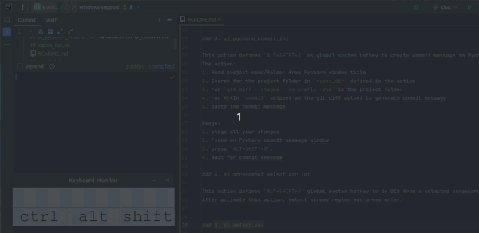

# CopyQ Custom Actions

This repository contains a collection of CopyQ custom actions which triggers KrAIna actions.

## Files Overview

### 1. kraina_run.ini

Define `ALT+SHIFT+~` global system hotkey to start KrAIna Chat application if not started. If started, show it.


### 2. toggle.ini

This action defines `CTRL+~` as global system hotkey to show/hide CopyQ application.
This is the best option to have such global hotkey working.

### 3. ai_pycharm_commit.ini

This action defines `ALT+SHIFT+3` as global system hotkey to create commit message in Pycharm.
The action:
1. Read project name/folder from Pycharm window title
2. Search for the project folder in `repos_dir` defined in the action
3. run `git diff --staged --no-prefix -U10` in the project folder
4. run KrAIn `commit` snippet on the git diff output to generate commit message
5. paste the commit message

Usage:
1. Stage all your changes.
2. Focus on the PyCharm commit message window.
3. Press `ALT+SHIFT+3`.
4. Wait for the commit message.



### 4. ai_screenshot_select_ocr.ini

This action defines `ALT+SHIFT+2` global system hotkey to do OCR from a selected screenshot.
After activating this action, select screen region and press enter.


### 5. ai_select.ini

This action defines `ALT+SHIFT+1` as global system hotkey to do transformation (call listed snippet) on selected text.


### 6. ai_translate.ini

This action translates the copied text to another language.


## Importing Actions into CopyQ

To import these actions into CopyQ:

1. Open CopyQ and go to `Command/Global shortcuts...` <F6>.
2. Select `Load Commands...` and import the `copyQ/*.ini` file.
3. Edit snippet:
   * Adjust the path to your needs:
    ``` js
   // Set KrAIna installation folder in your home folder 
   var kraina_dir = '/Documents/krAIna/';
   ```
   * Change or remove shortcuts if needed (global shortcut ALT+SHIFT+1, CopyQ shortcut ALT+RETURN).
4. Save and that's all.


